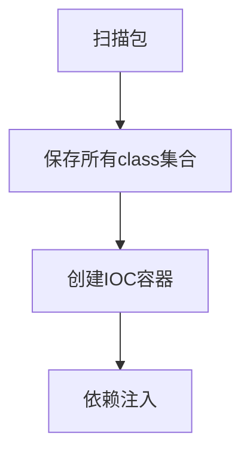

# 手写Spring核心功能第一篇：IOC与DI

## 说明

​    Spring核心功能基本可以划分为三个，即IOC，DI与AOP。本文则着手于实现简易得到IOC与DI，AOP在在另一篇文章中单独实现。

## 注解类

- YComponent

```java
package indi.yp.annotation;

import java.lang.annotation.Documented;
import java.lang.annotation.ElementType;
import java.lang.annotation.Retention;
import java.lang.annotation.RetentionPolicy;
import java.lang.annotation.Target;

import org.springframework.stereotype.Component;

/**
 * @ClassName: YComponent
 * @author yPan
 */
@Documented
@Retention(RetentionPolicy.RUNTIME)
@Target(ElementType.TYPE)
@Component
public @interface YComponent {
    String value() default "";
}
```

- YAutowried

```java
package indi.yp.annotation;

import java.lang.annotation.Documented;
import java.lang.annotation.ElementType;
import java.lang.annotation.Retention;
import java.lang.annotation.RetentionPolicy;
import java.lang.annotation.Target;

/** 
* @ClassName: YAutowired 
* @author yPan  
*/
@Documented
@Retention(RetentionPolicy.RUNTIME)
@Target(ElementType.FIELD)
public @interface YAutowired {

}
```

## 普通组件

- ComponentA

```java
package indi.yp.component;

import org.slf4j.Logger;
import org.slf4j.LoggerFactory;

import indi.yp.annotation.YComponent;

/**
 * @ClassName: ComponentA
 * @author yPan
 */
@YComponent
public class ComponentA {
    private static final Logger LOGGER = LoggerFactory.getLogger(ComponentA.class);

    public void say() {
        LOGGER.info("A.say!");
    }
}
```

- ComponentB

```java
package indi.yp.component;

import org.slf4j.Logger;
import org.slf4j.LoggerFactory;

import indi.yp.annotation.YAutowired;
import indi.yp.annotation.YComponent;

/**
 * @ClassName: ComponentB
 * @author yPan
 */
@YComponent
public class ComponentB {
    private static final Logger LOGGER = LoggerFactory.getLogger(ComponentB.class);
    @YAutowired
    private ComponentA componentA;

    public void say() {
        componentA.say();
        LOGGER.info("B.say!");
    }

}
```

## 核心实现

- 实现逻辑-大纲说明



- 变量说明

```java
// 扫描包的路径
String packageName = "indi.yp";
// 所有类的集合
List<String> clazzs = new ArrayList<>();
// IOC容器
Map<String, Object> ioc = new HashMap<>();
```

1. 扫描包并且保存class集合

```java
    public static void doScan(String packageName, List<String> clazzs) {
        String path = Application.class.getResource("/" + packageName.replaceAll("\\.", "/")).getPath();
        LOGGER.info("path:{}", path);
        File file = new File(path);
        for (File tmp : file.listFiles()) {
            if (tmp.isDirectory()) {
                doScan(packageName + "." + tmp.getName(), clazzs);
            } else {
                clazzs.add(packageName + "." + StringUtils.replace(tmp.getName(), ".class", ""));
            }

        }

    }
```

2. 创建IOC容器

```java
    public static void doIoc(List<String> clazzs, Map<String, Object> ioc) {
        clazzs.forEach(x -> {
            try {
                Class<?> clazz = Class.forName(x);
                // 被YComponent注解了
                if (clazz.isAnnotationPresent(YComponent.class)) {
                    YComponent yComponent = clazz.getAnnotation(YComponent.class);
                    LOGGER.info("clazz.name:{},component.value:{}", clazz.getSimpleName(), yComponent.value());
                    try {
                        Object instance = clazz.newInstance();
                        if (StringUtils.isBlank(yComponent.value())) {
                            ioc.put(lowwerFirstLetter(clazz.getSimpleName()), instance);
                        } else {
                            ioc.put(lowwerFirstLetter(clazz.getSimpleName()), instance);
                            ioc.put(yComponent.value(), instance);
                        }
                    } catch (InstantiationException e) {
                        LOGGER.error(e.getMessage(), e);
                    } catch (IllegalAccessException e) {
                        LOGGER.error(e.getMessage(), e);
                    }
                }

            } catch (ClassNotFoundException e) {
                LOGGER.error(e.getMessage(), e);
            }

        });

    }
```

3. 实现依赖注入

```java
public static void doAutowired(Map<String, Object> ioc) {
        ioc.forEach((x, y) -> {
            Field[] fields = y.getClass().getDeclaredFields();
            for (Field field : fields) {
                // 被YAutowired注解了
                if (field.isAnnotationPresent(YAutowired.class)) {
                    Object obj = null;
                    if (ioc.containsKey(field.getName())) {
                        obj = ioc.get(field.getName());
                    } else {
                        obj = ioc.get(lowwerFirstLetter(field.getType().getSimpleName()));
                    }
                    if (null == obj) {
                        LOGGER.warn("class :{} can not find component : {}", y.getClass(), field.getName());
                        return;
                    }

                    try {
                        // 暴力访问私有属性
                        field.setAccessible(true);
                        field.set(y, obj);
                    } catch (IllegalArgumentException e) {
                        LOGGER.error(e.getMessage(), e);
                    } catch (IllegalAccessException e) {
                        LOGGER.error(e.getMessage(), e);
                    }
                }
            }

        });

    }
```

4. 首字母小写

```java
    private static String lowwerFirstLetter(String s) {
        char[] chars = s.toCharArray();
        String firstChar = String.valueOf(chars[0]);
        chars[0] = firstChar.toLowerCase().charAt(0);// 转小写
        LOGGER.info("s:{},return:{}", s, String.valueOf(chars));
        return String.valueOf(chars);
    }
```

## 总结说明

- 代码

```java
// 扫描包
doScan(packageName, clazzs);
LOGGER.info("clazzs:{}", JSONObject.toJSONString(clazzs));
// IOC容器
doIoc(clazzs, ioc);
LOGGER.info("ioc:{}", JSONObject.toJSONString(ioc));
// autowired
doAutowired(ioc);
// test
ComponentB componentB = (ComponentB) ioc.get("componentB");
componentB.say();
```

